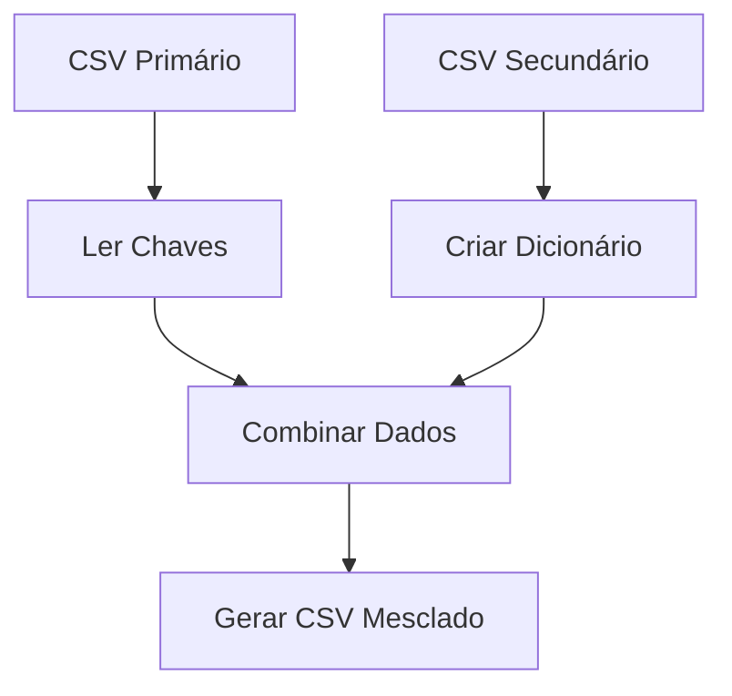

# 🔄 CSV Merger Tool

Ferramenta em Go para combinar dois arquivos CSV baseado em chaves compostas.


## ✨ Funcionalidades
- **Merge Inteligente**: Combina dados de dois CSVs usando múltiplas colunas como chave
- **Configuração via Ambiente**: Variáveis de ambiente para controle total
- **Substituição Segura**: Mantém valor padrão para registros não encontrados
- **Validação Rigorosa**: Verifica colunas obrigatórias automaticamente

## ⚙️ Pré-requisitos
- Go 1.16+
- Biblioteca Zerolog: `go get github.com/rs/zerolog`

## 🔧 Configuração (.env)
```ini
DATA_OUTPUT_DIR=resultados    # Pasta de saída
FIRST_CSV=dados_primarios.csv # Caminho do primeiro CSV
SECOND_CSV=dados_secundarios.csv # Caminho do segundo CSV
KEY_COLUMNS_FIRST=id,data     # Colunas-chave do primeiro CSV (separadas por vírgula)
KEY_COLUMNS_SECOND=id,data    # Colunas-chave do segundo CSV
OVERWRITE_COLUMN=status       # Coluna para sobrescrever no primeiro CSV
SOURCE_COLUMN=valor           # Coluna fonte do segundo CSV
DEFAULT=indefinido            # Valor padrão para registros não encontrados
```

## 🚀 Uso
1. Configure o `.env`
2. Execute:
```bash
go run main.go
```
3. Resultado será salvo em:
```
resultados/merged_dados_primarios.csv
```

## 📌 Exemplo Prático
**CSV Primário**:
```csv
id,data,status
1,2023-01,antigo
2,2023-02,antigo
```

**CSV Secundário**:
```csv
id,data,valor
1,2023-01,novo
3,2023-03,novo
```

**Saída**:
```csv
id,data,status
1,2023-01,novo
2,2023-02,indefinido
```

## 🔄 Fluxo de Processamento


## 🛑 Solução de Problemas
- **Colunas Faltando**: Verifique os nomes no header
- **Arquivo Não Encontrado**: Confira caminhos no `.env`
- **CSV Vazio**: Valide conteúdo dos arquivos

## 📄 Licença
MIT License - Veja [LICENSE](LICENSE) para detalhes.