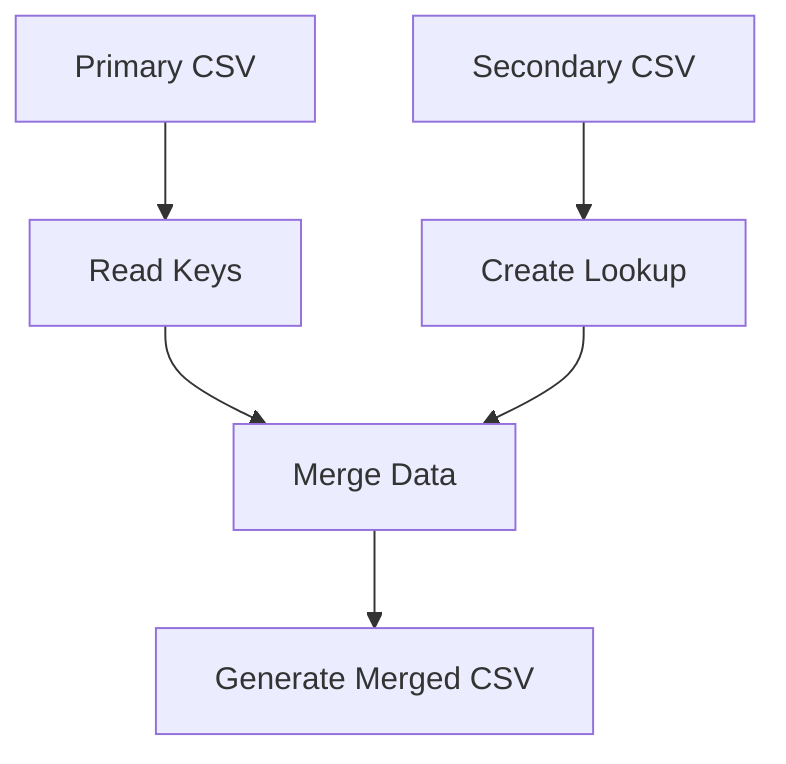

# 🔄 CSV Merger Tool

Go tool for merging two CSV files using composite keys.


## ✨ Features
- **Smart Merging**: Combines data from two CSVs using multi-column keys
- **Env Configuration**: Environment variables for full control
- **Safe Overwrite**: Default value for unmatched records
- **Auto Validation**: Checks required columns automatically

## ⚙️ Prerequisites
- Go 1.16+
- Zerolog Library: `go get github.com/rs/zerolog`

## 🔧 Configuration (.env)
```ini
DATA_OUTPUT_DIR=output        # Output directory
FIRST_CSV=primary.csv        # Path to first CSV
SECOND_CSV=secondary.csv     # Path to second CSV
KEY_COLUMNS_FIRST=id,date    # Key columns from first CSV (comma-separated)
KEY_COLUMNS_SECOND=id,date   # Key columns from second CSV
OVERWRITE_COLUMN=status      # Column to overwrite in first CSV
SOURCE_COLUMN=value          # Source column from second CSV
DEFAULT=undefined            # Default value for unmatched records
```

## 🚀 Usage
1. Configure `.env`
2. Run:
```bash
go run main.go
```
3. Output saved to:
```
output/merged_primary.csv
```

## 📌 Example
**Primary CSV**:
```csv
id,date,status
1,2023-01,old
2,2023-02,old
```

**Secondary CSV**:
```csv
id,date,value
1,2023-01,new
3,2023-03,new
```

**Output**:
```csv
id,date,status
1,2023-01,new
2,2023-02,undefined
```

## 🔄 Processing Flow


## 🛑 Troubleshooting
- **Missing Columns**: Verify header names
- **File Not Found**: Check `.env` paths
- **Empty CSV**: Validate file contents

## 📄 License
MIT License - See [LICENSE](LICENSE) for details.